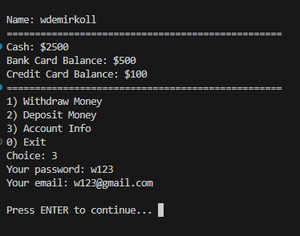

# Bank App

A simple console-based bank application with menu options. Users register with a username, password, and email. The application allows users to view their cash balance, bank and credit card balances, deposit and withdraw money from cards, and convert funds back to cash.

---

# Disclaimer ❗❗❗
This project has been developed for learning and practice purposes only. It is not intended for use in a production (live) environment. Some features may be intentionally incomplete, and certain functionalities may not be fully developed or finalized. In addition, security measures are not fully implemented or thoroughly tested, which may result in potential vulnerabilities or unexpected behavior. Therefore, it is strongly advised not to use this project directly in real-world or critical systems, as it may not meet the required standards for reliability, stability, or security.

---

## Prewiev



---

## Requirements

Before building the project, make sure you have:

- C/C++ (C++17) compatible compiler (GCC, Clang or MSVC)
- CMake 3.15 or newer

---

## Verification of Installation

Check if the required tools are installed:

```bash
cmake --version
g++ --version
```

Both commands should return version information.

### If Not Installed

#### Windows
- Install MinGW (GCC) or Visual Studio (MSVC)
- Make sure the compiler is added to system PATH

#### Linux
```bash
sudo apt update
sudo apt install build-essential cmake
```

#### macOS
```bash
brew install cmake gcc
```

---

## Build and Run

### Clone the Repository
```bash
git clone https://github.com/wdemirkoll/SimpleBankApp.git
cd SimpleBankApp
```

### Build the Project
```bash
mkdir build
cd build
cmake ..
cmake --build .
```

### Run the Application

```bash
# Windows
./SimpleBankApp.exe

# Linux / macOS
./SimpleBankApp
```

---

## Troubleshooting

### Clean Build
If you encounter build issues, try a clean build:

```bash
rm -rf build
mkdir build && cd build
cmake ..
cmake --build .
```

### Compiler Check
Verify that your compiler is properly installed:

```bash
g++ --version
```

If this fails, the compiler is either not installed or not added to PATH.

### CMake Configuration Issues
If CMake configuration fails:
```bash
cmake --version  # Verify that CMake is 3.15 or newer
which cmake      # (Linux/macOS) or where cmake (Windows)
```

### Build Errors
- Make sure you are using a C/C++ (C++17) compatible compiler
- Check that all dependencies are installed
- Try removing the `build` directory and rebuilding from scratch

---

## **Author**

#### **Abdüsselam Demirkol**  
#### GitHub: wdemirkoll

### 🗓 Created: April 2026

---

 ## After the game projects, this project was a bit challenging..
 ## 🥱😴

